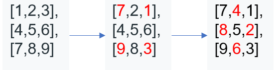

#48：[旋转图像](https://leetcode-cn.com/problems/rotate-image/)

> 中等，数组

1. [审题](#审题)
2. [剥洋葱交换法](#剥洋葱交换法)

## 审题

题目禁止开辟新的二维矩阵空间。

## 剥洋葱交换法

### 点睛

之所以叫做剥洋葱法，就是将矩阵看做一由内而外一层一层的，而不是自上而下的层。然后对每次层进行顺时针移动，直至移动完毕。在每一层的移动当中 ，也是分组移动的，

综合的逻辑过程如下图所示：



首先移动最外层。在这层中，分两组移动。之后本层就成功的顺时针旋转了。

在这个过程中有两个参数需要注意，其一为矩阵的层数，其二为每一层中的移动组数。通过分析逻辑过程，我们可以很容易得到：

- 层数 = (matrix.length) / 2

- 组数 = 本层维数 - 1 [^1]

### 解法

1. 根据上述逻辑移动元素即可。

### 代码

```java
    public void s1(int[][] matrix) {
        // n 为矩阵的维数
        int n = matrix.length - 1, temp;
        // 一层层的替换
        for (int i = 0; i < (matrix.length) / 2; i++) {
            // n - i - 1 是取本层的组数，n-i 是本层的维数。
            for (int j = i; j <= n - i - 1; j++) {
                temp = matrix[i][j];
                // 逆时针移动。
                matrix[i][j] = matrix[n - j][i];
                matrix[n - j][i] = matrix[n - i][n - j];
                matrix[n - i][n - j] = matrix[j][n - i];
                matrix[j][n - i] = temp;
            }
        }
    }
```

### 时间空间复杂度分析

时间复杂度：O(n)，只遍历了一遍元素

空间复杂度：O(1)

[^1]:不明白的可以画一个四维矩阵试一试。
